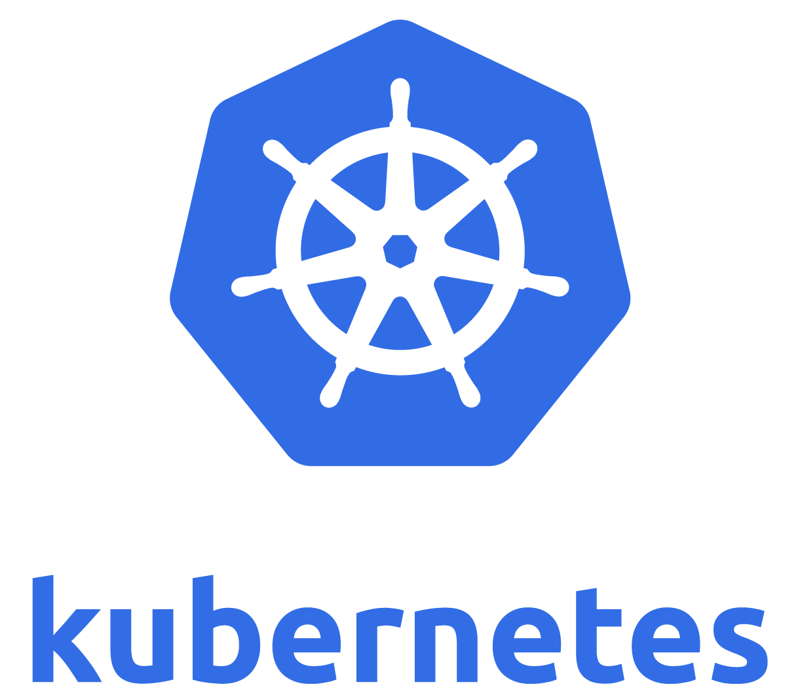

# SFTP

Forked from atmoz to make it easier to setup on kubernetes and share a volume to a group of people. 
adds fail2ban from [this pr](https://github.com/atmoz/sftp/pull/189). 
merges in a number of PRs to fix a number of issues

  




<!-- TOC depthfrom:2 -->

- [Supported tags and respective `Dockerfile` links](#supported-tags-and-respective-dockerfile-links)
- [Quickstart Example](#quickstart-example)
- [Summary](#summary)
    - [Simplest docker run example](#simplest-docker-run-example)
- [Volume DATAMOUNT env](#volume-datamount-env)
    - [Data Volume Examples](#data-volume-examples)
- [User Credentials](#user-credentials)
    - [users.conf](#usersconf)
    - [Encrypted passwords](#encrypted-passwords)
    - [User SSH pub keys](#user-ssh-pub-keys)
- [Providing server SSH host keys (recommended)](#providing-server-ssh-host-keys-recommended)
- [Execute custom scripts or applications](#execute-custom-scripts-or-applications)
- [Bindmount dirs from another location](#bindmount-dirs-from-another-location)
- [Kubernetes](#kubernetes)
    - [Install process](#install-process)
    - [Maintain Users](#maintain-users)

<!-- /TOC -->
## Supported tags and respective `Dockerfile` links

- debian:buster-slim [`latest` (*Dockerfile*)](https://github.com/yakworks/docker-sftp/blob/master/Dockerfile) [](https://hub.docker.com/r/yakworks/sftp/tags)

**Securely share your files**

Easy to use SFTP ([SSH File Transfer Protocol](https://en.wikipedia.org/wiki/SSH_File_Transfer_Protocol)) server with [OpenSSH](https://en.wikipedia.org/wiki/OpenSSH).
This is an automated build linked with the [debian](https://hub.docker.com/_/debian/) repositories.


## Quickstart Example 

To run the opionionated example in this project `./examples/docker/docker-run.sh`
See README there for more info

## Summary

- Define users in (1) command arguments, (2) `SFTP_USERS` environment variable
  or (3) in file mounted as `/etc/sftp/users.conf` (syntax:
  `user:pass[:e][:uid[:gid[:dir1[,dir2]...]]] ...`, see below for examples)
  - Set UID/GID manually for your users if you want them to make changes to
    your mounted volumes with permissions matching your host filesystem.
  - If uid is not specified then it will be automatically created starting at 1000
  - If GID is not specified then it will default to 100:users
  - Directory names at the end will be created under user's home directory with
    write permission, if they aren't already present.
  - if a dir is not specified then it defaults to `/home/:user/data`

- **Fail2Ban** is configured with intelligent defaults and the logs for both var/log/auth.log 
  and /var/log/  fail2ban.conf is tailed to the output for docker and kubernetes
  - for fail2ban to work it needs the `--cap-add=NET_ADMIN` permissions added to docker. if your running into 
    issues then, while not recomended, you can brute force it with `--privileged`
  - in kubernetes the container should have 
    ```
    securityContext:
      privileged: true # only need
      capabilities:
        add: ["SYS_ADMIN", "NET_ADMIN"]
    ```

### Simplest docker run example

```
docker run -p 2222:22 -d yakworks/sftp foo:pass
```

The OpenSSH server runs by default on port 22, and in this example, we are forwarding the container's port 22 to the host's port 2222. To log in with the OpenSSH client, run: `sftp -P 2222 foo@127.0.0.1`

User "foo" with password "pass" can login with sftp and upload files to the default folder called "data". No mounted directories or custom UID/GID. Later you can inspect the files and use `--volumes-from` to mount them somewhere else (or see next example).

NOTE: in this example Fail2Ban will probably fail as it needs the NET_ADMIN capability

## Volume DATA_MOUNT env

Opinionated defaults. This sets users and groups in a number of ways that attempt to make sharing files
cleaner across multiple users

set the `DATA_MOUNT` environment var to the dir that was mounted in volumes.

- if the data volume is mounted then it will create a "home" `/data/users/:user` for each user
- **users group**: a `users` or `100` group is considered limited in visibility, ex:`foo:pass::user`
  - `users` will have the home `/data/users/:user` bind mounted to their chroot `/home/:user/home` and read/write be limited to that dir
- **staff/owner group**: a `staff` or `50` group is considered an owner, ex:`foo:pass::staff`.
  - `staff` will also have the home `/data/users/:user` bind mounted to their chroot `/home/:user/home`
  - staff will also have the `/$DATA_MOUNT` bind mounted in their chroot `/home/:user/data` and will have full rw access to the whole dir.
  - staff will have primary group of `users` and will also have staff group as secondary
- any directories in the user definition are additional bind mounts in users base dir in addition to `home` and `data`. This can be used to give user access to dirs in `/data`
- `--cap-add=SYS_ADMIN` is needed for the mounting. see kubernetes example for adding securityContext.capabilities

### Data Volume Examples

Let's mount a directory and make a user and staf owner with UIDs as well. 

```
mkdir -p target/sftp-vol/private
mkdir -p target/sftp-vol/public

docker run --cap-add=NET_ADMIN --cap-add=SYS_ADMIN \
  -e DATA_MOUNT=/sftp-data \
  -v $(pwd)/target/sftp-vol:/sftp-data \
  -p 2222:22 -d yakworks/sftp \
  owner1:pass::staff user1:pass::users:/sftp-data/public
```

this will create a 
Both users will have a `home` dir in their root dir when they login. This will point to the 
`target/yakbox-sftp/home/:user` that was created for them.
In this example when they owner1 user sftp's in they will have a `sftp-data` dir that is 
essentially mapped to the `target/sftp-vol` dir via the `DATA_MOUNT` share and can see every thing. 

The user1 will end up having a `home` dir and because of the user config will also be able to 
see `sftp-data/public` that is mapped to `target/sftp-vol/public`

Also, go ahead and try out fail2ban. enter 5 bad logins and see what happens. 

## User Credentials

### users.conf

```
echo "
owner:123:1001:staff
bar:abc:1006:100
baz:xyz:1098:users
" >> target/users.conf

docker run --cap-add=NET_ADMIN --cap-add=SYS_ADMIN  \
    -v $(pwd)/target/users.conf:/etc/sftp/users.conf:ro \
    -v $(pwd)/store/onebox-sftp:/data \
    -p 2222:22 -d yakworks/sftp
```

note: 100 is the `users` group so either id will work or name

In this example it will create 

### Encrypted passwords

Add `:e` behind password to mark it as encrypted. Use single quotes if using terminal.

```
docker run --cap-add=NET_ADMIN --cap-add=SYS_ADMIN \
    -v /host/share:/home/foo/share \
    -p 2222:22 -d yakworks/sftp \
    'foo:$1$0G2g0GSt$ewU0t6GXG15.0hWoOX8X9.:e:1001'
```

Tip: you can use [atmoz/makepasswd](https://hub.docker.com/r/atmoz/makepasswd/) to generate encrypted passwords:  
`echo -n "your-password" | docker run -i --rm atmoz/makepasswd --crypt-md5 --clearfrom=-`

### User SSH pub keys

**Option 1 - volume mapping each user key**

Mount public keys in the user's `.ssh/keys/` directory. All keys are automatically appended to `.ssh/authorized_keys` (you can't mount this file directly, because OpenSSH requires limited file permissions). In this example, we do not provide any password, so the user `foo` can only login with his SSH key.

```
docker run --cap-add=NET_ADMIN --cap-add=SYS_ADMIN \
    -v /host/id_rsa.pub:/home/foo/.ssh/keys/id_rsa.pub:ro \
    -v /host/id_other.pub:/home/foo/.ssh/keys/id_other.pub:ro \
    -v /host/share:/home/foo/share \
    -p 2222:22 -d atmoz/sftp \
    foo::1001
```

**Option 2 - mapping volume with all keys**

This is best option for kubernetes as you can easily create a secret configmap with each users public key and map to that secret as a volume
create a volume mapping to `/etc/sftp/authorized_keys.d`. On start the container will spin through all pub files in that directory and add automatically appended to `/home/:user/.ssh/authorized_keys`. format should be `:user_rsa.pub`. 
For example, if you have a directory called secure/ssh-user-keys with the key files `ziggy_rsa.pub` and `bob_rsa.pub`

```
docker run --cap-add=NET_ADMIN --cap-add=SYS_ADMIN \
    -v secure/ssh-user-keys:/etc/sftp/authorized_keys.d \
    -p 2222:22 -d atmoz/sftp \
    ziggy::1001 bob::1002
```

The `examples/docker` shows this in action

## Providing server SSH host keys (recommended)

For consistent server fingerprint, mount `/etc/sftp/host_keys.d` with your 
ssh_host_ed25519_key and ssh_host_rsa_key host keys. OpenSSH seems to requires limited file permissions on these as well so in init it will copy the files from host_keys.d to etc/ssh.

If not then this container will generate new SSH host keys at first run. To avoid that your users get a MITM warning when you recreate your container (and the host keys changes), you can mount your own host keys.

Tip: you can generate your keys with these commands:

```
ssh-keygen -t ed25519 -f ssh_host_ed25519_key < /dev/null
ssh-keygen -t rsa -b 4096 -f ssh_host_rsa_key < /dev/null
```

or using this docker image itself

```
mkdir keys

# runs the image and copies the keys out to use then exits
docker run -it --rm -v $(pwd):/workdir yakworks/sftp \
cp /etc/ssh/ssh_host_ed25519_key* /etc/ssh/ssh_host_rsa_key* /workdir/keys
```

## Execute custom scripts or applications

Put your programs in `/etc/sftp.d/` and it will automatically run when the container starts.
See next section for an example.

## Bindmount dirs from another location

- Users are chrooted to their home directory, so you can mount the
  volumes in separate directories inside the user's home directory
  (/home/user/**mounted-directory**) or just mount the whole **/home** directory.
  Just remember that the users can't create new files directly under their
  own home directory, so make sure there are at least one subdirectory if you
  want them to upload files.

If you are using `--volumes-from` or just want to make a custom directory available in user's home directory, you can add a script to `/etc/sftp.d/` that bindmounts after container starts.

```
#!/bin/bash
# File mounted as: /etc/sftp.d/bindmount.sh
# Just an example (make your own)

function bindmount() {
    if [ -d "$1" ]; then
        mkdir -p "$2"
    fi
    mount --bind $3 "$1" "$2"
}

# Remember permissions, you may have to fix them:
# chown -R :users /data/common

bindmount /data/admin-tools /home/admin/tools
bindmount /data/common /home/dave/common
bindmount /data/common /home/peter/common
bindmount /data/docs /home/peter/docs --read-only
```

**NOTE:** Using `mount` requires that your container runs with the `CAP_SYS_ADMIN` capability turned on. [See this answer for more information](https://github.com/atmoz/sftp/issues/60#issuecomment-332909232).

## Kubernetes

See the example in kubernetes dir [examples/kubernetes/README.md](examples/kubernetes/README.md)

One way to keep this straight forward is to map secrets and their keys as volume files. 
Then users and the ssh keys can be mapped per the examples

### Install process

1. run `./keygen.sh`. take a look at script for what it does but gens keys and copies the secret-*.yml fiels into keys dir for editing. the keys dir should be in .gitignore and should not be checked in to github. 

2. Edit secret-host-keys.yml and copy in the keys that were generated into the the dir.

3. Edit secret-user-conf.yml to add or update users and set to initial secure passwords. 

    >NOTE: UPDATE THE pAsWoRd to something secure, DO NOT RUN IT AS IS! This is just a githuib checked in example

4. Run the `./install.sh` script or look inside it and run each item by hand. 

    >NOTE: the end of the install script will delete the keys dir so keep that in mind!

5. if you have a botched run and need to clean up then run
    ```
    kubectl delete deployment,svc,configmap,secret --namespace=storage --selector=role=sftp
    ```

6. add a tcp entry to the Linode node balancer to pass 30022 to the nodes 30022. Add an entry to the DNS to point sftp.9ci.com to that nodebalancer


### Maintain Users

To add or remove users just edit the sftp-user-conf secret. Easy to do in Rancher. Will need to redeploy ("restart") the  deployment
